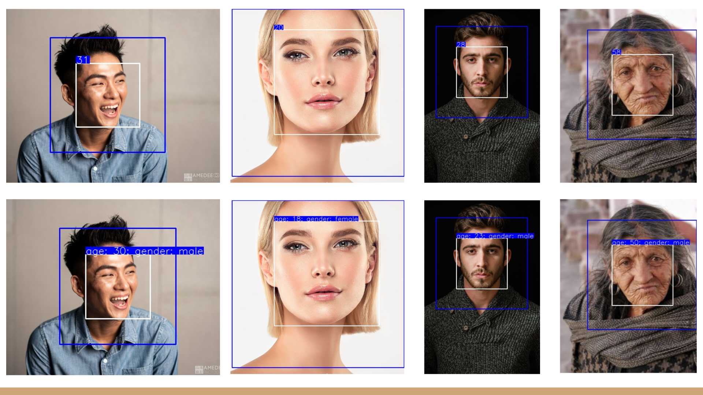

# Age and Gender Estimation PyTorch (MTL)
PyTorch-based CNN implementation for estimating age and gender from face images.
Currently only the APPA-REAL dataset is supported.

We worked on the original model of only age prediction and change it to a multi-task model for predicting both age and gender. (All original files are replaced by updated one considering the MTL Method)


## Requirements

```bash
pip install -r requirements.txt
```

## Demo
Webcam is required.
See `python demo.py -h` for detailed options.

```bash
python demo.py
```

Using `--img_dir` argument, images in that directory will be used as input  

Using `--output_dir` argument,
resulting images will be saved in that directory (no resulting image window is displayed in this case):

Further using `--resume` argumet, resume from this checkpoint

```bash
python demo.py --img_dir [PATH/TO/IMAGE_DIRECTORY] --output_dir [PATH/TO/OUTPUT_DIRECTORY] --resume [FILE NAME/OF/CHECKPOINT]
```

## Train

#### Download Dataset

Download and extract the [APPA-REAL dataset](http://chalearnlap.cvc.uab.es/dataset/26/description/).

> The APPA-REAL database contains 7,591 images with associated real and apparent age labels. The total number of apparent votes is around 250,000. On average we have around 38 votes per each image and this makes the average apparent age very stable (0.3 standard error of the mean).
> Use other attributes from extended [APPA-REAL dataset](http://chalearnlap.cvc.uab.es/dataset/26/description/), e.g. ethnic, makeup, gender, expression, to train in a multi-task setting

```bash
wget http://158.109.8.102/AppaRealAge/appa-real-release.zip
unzip appa-real-release.zip
```

```bash
wget http://sergioescalera.com/wp-content/uploads/2018/06/allcategories_trainvalidtest_split.zip
unzip allcategories_trainvalidtest_split.zip -d /content/drive/MyDrive/project_map583/extended_data
```

#### Train Model
Train a model using the APPA-REAL dataset.
See `python train.py -h` for detailed options.

```bash
python train.py --data_dir_age [PATH/TO/appa-real-release] --data_dir_extended [PATH/TO/extended-data] --tensorboard tf_log
```

Check training progress:

```bash
tensorboard --logdir=tf_log
```


#### Training Options
You can change training parameters including model architecture using additional arguments like this:

```bash
python train.py --data_dir_age [PATH/TO/appa-real-release] --data_dir_extended [PATH/TO/extended-data] --tensorboard tf_log MODEL.ARCH se_resnet50 TRAIN.OPT sgd TRAIN.WEIGHTS_LOSS_HEAD [0.8,0.2]
```

All default parameters defined in [defaults.py](defaults.py) can be changed using this style.
